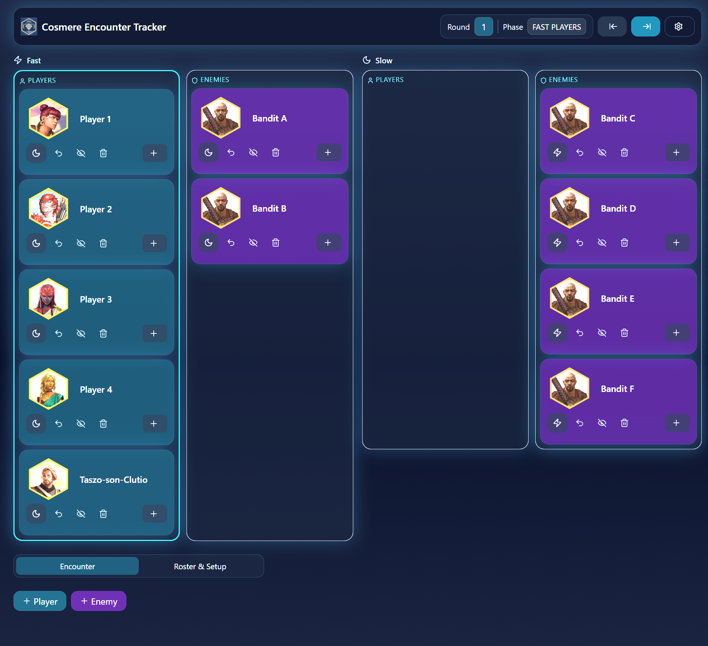
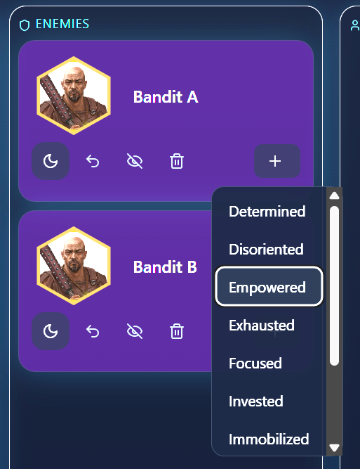
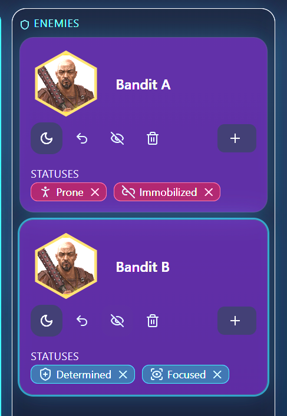
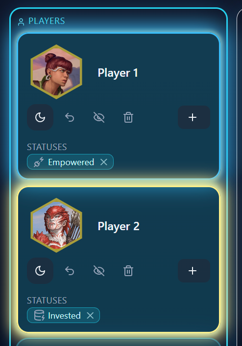
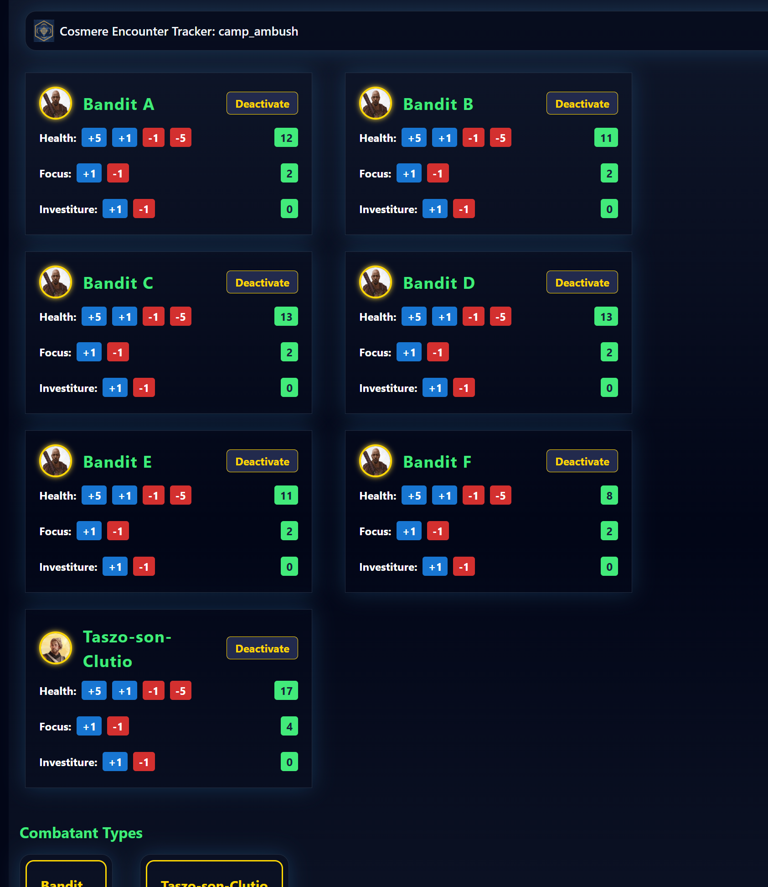
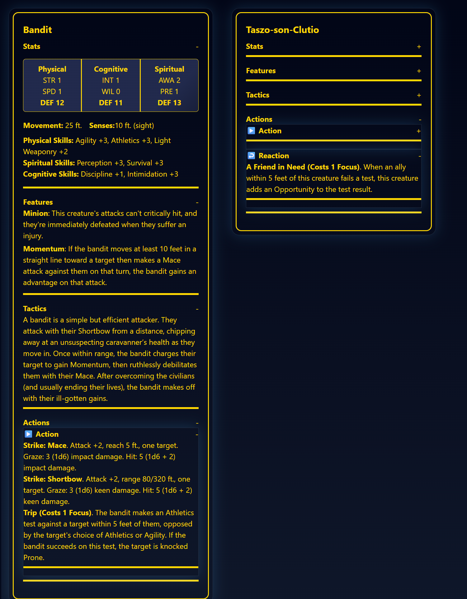

# What is this
This is a fan made combat tracker for the Cosmere RPG system.

Current state is just for me to track this sort of stuff at home in person (with a screen for the players). 
Understand full well that this is half generated with Prompts and some cleanup by me. For an official open source release, it would need a lot of cleanup...
Maybe this can help others.

## Features
Player Screen
.

### Combatant Conditions




#### Some special effects when Invested
  
<video src='docs/empowered_glow.mp4' width=400 />


## GM Screen
Selecting an encounter loads another page with the split out information there for the GM.


### Tactics and Actions



# Running it
Right now I'm just on planning on my laptop while I play with
```shell
npm run dev
```
Loads it up just using npm.